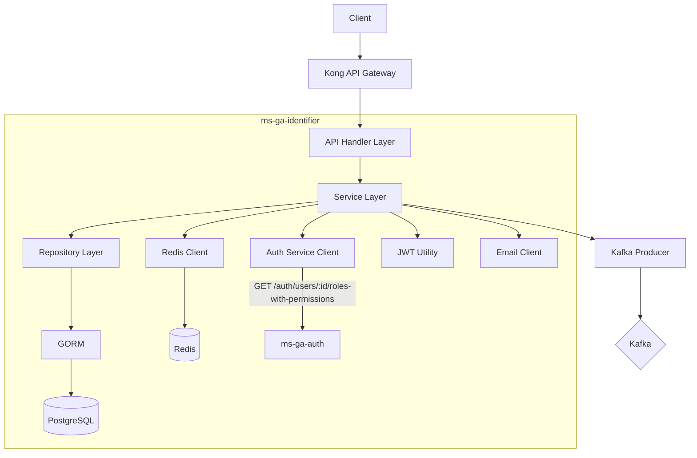

# ms-ga-identifier — Identity Service

## Overview

| Property         | Value                |
| ---------------- | -------------------- |
| **Language**     | Go 1.23+             |
| **Framework**    | Gin                  |
| **Database**     | PostgreSQL 15 (GORM) |
| **Cache**        | Redis                |
| **Port**         | 8081                 |
| **Base Path**    | `/identity`          |
| **Architecture** | Clean Architecture   |

**Purpose:** The Identity Service is the single entry point for all authentication operations. It manages _who you are_ — credentials, sessions, and JWT token lifecycle. At login time, it calls `ms-ga-auth` to fetch the user's roles and permissions, then embeds them directly into the JWT (fat token). It does NOT handle authorization decisions — that is the responsibility of each downstream service using the JWT claims.

---

## Architecture Diagram



---

## Project Structure

```
ms-ga-identifier/
├── api/
│   └── openapi.yaml                    # OpenAPI 3.0 spec
├── cmd/
│   └── api/
│       └── main.go                     # Entry point
├── internal/
│   ├── api/
│   │   ├── generated/
│   │   │   └── models.gen.go           # oapi-codegen generated models
│   │   ├── handler/
│   │   │   ├── identity_handler.go     # Register, login, logout
│   │   │   ├── token_handler.go        # Refresh, verify
│   │   │   └── password_handler.go     # Forgot/reset password
│   │   └── router/
│   │       └── router.go               # Route definitions
│   ├── converter/
│   │   └── identity_converter.go       # DTO <-> Entity mappers
│   ├── domain/
│   │   ├── entity/
│   │   │   ├── identity.go             # Identity domain entity
│   │   │   ├── refresh_token.go        # RefreshToken domain entity
│   │   │   ├── login_attempt.go        # LoginAttempt domain entity
│   │   │   └── password_reset.go       # PasswordResetToken domain entity
│   │   └── repository/
│   │       ├── identity_repository.go  # Identity repository interface
│   │       ├── token_repository.go     # RefreshToken repository interface
│   │       └── attempt_repository.go   # LoginAttempt repository interface
│   ├── infrastructure/
│   │   ├── persistence/
│   │   │   └── gorm/
│   │   │       ├── mapper/
│   │   │       │   └── mapper.go       # Entity <-> GORM model mappers
│   │   │       ├── model/
│   │   │       │   ├── identity.go     # GORM model
│   │   │       │   ├── refresh_token.go
│   │   │       │   └── login_attempt.go
│   │   │       └── repository/
│   │   │           ├── identity_repository.go
│   │   │           ├── token_repository.go
│   │   │           └── attempt_repository.go
│   │   ├── messaging/
│   │   │   └── kafka_producer.go       # Kafka event publisher
│   │   └── external/
│   │       └── auth_client.go          # HTTP client for ms-ga-auth
│   ├── middleware/
│   │   ├── auth_middleware.go          # JWT validation for protected endpoints
│   │   └── correlation_id.go           # Correlation ID propagation
│   └── service/
│       ├── identity_service.go         # Registration, login, logout
│       ├── token_service.go            # Token refresh, JWT generation
│       └── password_service.go         # Password reset flow
├── pkg/
│   ├── config/
│   │   └── config.go                   # Config struct + loader
│   ├── database/
│   │   └── postgres.go                 # GORM connection
│   ├── redis/
│   │   └── redis.go                    # Redis connection
│   └── utils/
│       ├── logger.go                   # Zap logger
│       ├── jwt.go                      # JWT sign/parse utilities
│       ├── hash.go                     # bcrypt helpers
│       └── response.go                 # Standard response helpers
├── db/
│   └── migrations/
│       ├── V1__create_identities_table.sql
│       ├── V2__create_refresh_tokens_table.sql
│       ├── V3__create_login_attempts_table.sql
│       └── V4__create_password_reset_tokens_table.sql
├── docker-compose.yml
├── Dockerfile
├── Makefile
├── go.mod
├── oapi-codegen.yaml
└── README.md
```

---

## Domain Entities

### `Identity`

```go
type Identity struct {
    ID            uuid.UUID
    UserID        uuid.UUID   // Shared UUID across the system
    Email         string
    PasswordHash  string
    Status        IdentityStatus  // active | locked | suspended | unverified
    EmailVerified bool
    CreatedAt     time.Time
    UpdatedAt     time.Time
}

type IdentityStatus string
const (
    StatusActive      IdentityStatus = "active"
    StatusLocked      IdentityStatus = "locked"
    StatusSuspended   IdentityStatus = "suspended"
    StatusUnverified  IdentityStatus = "unverified"
)
```

### `RefreshToken`

```go
type RefreshToken struct {
    ID         uuid.UUID
    IdentityID uuid.UUID
    TokenHash  string      // SHA-256 hash of the actual token
    DeviceInfo string      // User-Agent or device name
    IPAddress  string
    ExpiresAt  time.Time
    CreatedAt  time.Time
    RevokedAt  *time.Time  // nil = active
}
```

### `LoginAttempt`

```go
type LoginAttempt struct {
    ID         uuid.UUID
    IdentityID *uuid.UUID  // nil for unknown email attempts
    Email      string
    IPAddress  string
    Success    bool
    AttemptedAt time.Time
}
```

### `PasswordResetToken`

```go
type PasswordResetToken struct {
    ID         uuid.UUID
    IdentityID uuid.UUID
    TokenHash  string
    ExpiresAt  time.Time
    UsedAt     *time.Time
    CreatedAt  time.Time
}
```

---

## Repository Interfaces

### `IdentityRepository`

```go
type IdentityRepository interface {
    Create(ctx context.Context, identity *entity.Identity) (*entity.Identity, error)
    GetByID(ctx context.Context, id uuid.UUID) (*entity.Identity, error)
    GetByEmail(ctx context.Context, email string) (*entity.Identity, error)
    GetByUserID(ctx context.Context, userID uuid.UUID) (*entity.Identity, error)
    Update(ctx context.Context, identity *entity.Identity) (*entity.Identity, error)
    UpdateStatus(ctx context.Context, id uuid.UUID, status entity.IdentityStatus) error
    UpdatePassword(ctx context.Context, id uuid.UUID, passwordHash string) error
    SetEmailVerified(ctx context.Context, id uuid.UUID) error
}
```

### `RefreshTokenRepository`

```go
type RefreshTokenRepository interface {
    Create(ctx context.Context, token *entity.RefreshToken) (*entity.RefreshToken, error)
    GetByTokenHash(ctx context.Context, tokenHash string) (*entity.RefreshToken, error)
    GetActiveByIdentityID(ctx context.Context, identityID uuid.UUID) ([]*entity.RefreshToken, error)
    Revoke(ctx context.Context, id uuid.UUID) error
    RevokeAllByIdentityID(ctx context.Context, identityID uuid.UUID) error
    DeleteExpired(ctx context.Context) error
}
```

### `LoginAttemptRepository`

```go
type LoginAttemptRepository interface {
    Create(ctx context.Context, attempt *entity.LoginAttempt) error
    CountRecentFailures(ctx context.Context, identityID uuid.UUID, since time.Time) (int, error)
    GetRecentByIdentityID(ctx context.Context, identityID uuid.UUID, limit int) ([]*entity.LoginAttempt, error)
}
```

---

## Service Interfaces

### `IdentityService`

```go
type IdentityService interface {
    Register(ctx context.Context, req RegisterRequest) (*RegisterResponse, error)
    Login(ctx context.Context, req LoginRequest) (*LoginResponse, error)
    Logout(ctx context.Context, accessToken string) error
    RefreshToken(ctx context.Context, refreshToken string) (*LoginResponse, error)
    ChangePassword(ctx context.Context, userID uuid.UUID, req ChangePasswordRequest) error
    GetActiveSessions(ctx context.Context, userID uuid.UUID) ([]*SessionInfo, error)
    RevokeSession(ctx context.Context, userID uuid.UUID, sessionID uuid.UUID) error
}

type PasswordService interface {
    ForgotPassword(ctx context.Context, email string) error
    ResetPassword(ctx context.Context, token string, newPassword string) error
    VerifyEmail(ctx context.Context, token string) error
}
```

---

## Service Logic

### Registration Flow

```
1. Validate email format and password strength
2. Check if email already exists → 409 Conflict
3. Generate new UUID for user_id
4. Hash password with bcrypt (cost=12)
5. Create Identity record with status=unverified
6. Generate email verification token
7. Publish identity.registered event to Kafka
8. Return success (email verification sent async via noti service)
```

### Login Flow

```
1. Find identity by email → 401 if not found
2. Check identity status → 403 if locked/suspended
3. Check recent failed attempts (Redis counter) → 429 if locked
4. bcrypt.Compare(password, hash) → 401 if mismatch
5. Record failed attempt in DB + increment Redis counter
6. On success: reset Redis counter
7. Call ms-ga-auth: GET /auth/users/:userID/roles-with-permissions
8. Build JWT claims: { sub, email, roles, permissions, jti, iat, exp }
9. Sign JWT with HS256 using JWT_SECRET
10. Generate refresh token (random 32 bytes), hash it, store in DB
11. Publish identity.logged_in event to Kafka
12. Return { access_token, refresh_token, expires_in: 900 }
```

### Logout Flow

```
1. Parse JWT from Authorization header
2. Extract jti claim
3. Calculate remaining TTL = exp - now
4. SET Redis key: blacklist:<jti> = "1" EX <remaining_ttl>
5. Revoke refresh token from DB (if provided)
6. Return 200 OK
```

### Token Refresh Flow

```
1. Hash the provided refresh token
2. Look up in DB by hash
3. Check not expired and not revoked
4. Call ms-ga-auth for fresh roles/permissions (permissions may have changed)
5. Issue new access token with fresh claims
6. Optionally rotate refresh token (issue new, revoke old)
7. Return new access_token
```

---

## Database Schema

### `identities` table

```sql
CREATE TABLE identities (
    id              UUID PRIMARY KEY DEFAULT gen_random_uuid(),
    user_id         UUID NOT NULL UNIQUE,
    email           VARCHAR(255) NOT NULL UNIQUE,
    password_hash   VARCHAR(255) NOT NULL,
    status          VARCHAR(20) NOT NULL DEFAULT 'unverified'
                    CHECK (status IN ('active', 'locked', 'suspended', 'unverified')),
    email_verified  BOOLEAN NOT NULL DEFAULT FALSE,
    created_at      TIMESTAMPTZ NOT NULL DEFAULT NOW(),
    updated_at      TIMESTAMPTZ NOT NULL DEFAULT NOW()
);

CREATE INDEX idx_identities_email ON identities(email);
CREATE INDEX idx_identities_user_id ON identities(user_id);
```

### `refresh_tokens` table

```sql
CREATE TABLE refresh_tokens (
    id          UUID PRIMARY KEY DEFAULT gen_random_uuid(),
    identity_id UUID NOT NULL REFERENCES identities(id) ON DELETE CASCADE,
    token_hash  VARCHAR(64) NOT NULL UNIQUE,
    device_info VARCHAR(255),
    ip_address  VARCHAR(45),
    expires_at  TIMESTAMPTZ NOT NULL,
    revoked_at  TIMESTAMPTZ,
    created_at  TIMESTAMPTZ NOT NULL DEFAULT NOW()
);

CREATE INDEX idx_refresh_tokens_identity_id ON refresh_tokens(identity_id);
CREATE INDEX idx_refresh_tokens_token_hash ON refresh_tokens(token_hash);
```

### `login_attempts` table

```sql
CREATE TABLE login_attempts (
    id           UUID PRIMARY KEY DEFAULT gen_random_uuid(),
    identity_id  UUID REFERENCES identities(id) ON DELETE SET NULL,
    email        VARCHAR(255) NOT NULL,
    ip_address   VARCHAR(45),
    success      BOOLEAN NOT NULL,
    attempted_at TIMESTAMPTZ NOT NULL DEFAULT NOW()
);

CREATE INDEX idx_login_attempts_identity_id ON login_attempts(identity_id);
CREATE INDEX idx_login_attempts_attempted_at ON login_attempts(attempted_at);
```

### `password_reset_tokens` table

```sql
CREATE TABLE password_reset_tokens (
    id          UUID PRIMARY KEY DEFAULT gen_random_uuid(),
    identity_id UUID NOT NULL REFERENCES identities(id) ON DELETE CASCADE,
    token_hash  VARCHAR(64) NOT NULL UNIQUE,
    expires_at  TIMESTAMPTZ NOT NULL,
    used_at     TIMESTAMPTZ,
    created_at  TIMESTAMPTZ NOT NULL DEFAULT NOW()
);

CREATE INDEX idx_password_reset_tokens_identity_id ON password_reset_tokens(identity_id);
```

---

## API Endpoints

### Public Endpoints (no auth required)

#### `POST /identity/register`

```yaml
Request:
  email: string (required, valid email)
  password: string (required, min 8 chars, must contain uppercase + number + special)
  first_name: string (required)
  last_name: string (required)

Response 201:
  success: true
  data:
    user_id: uuid
    email: string
    message: "Registration successful. Please verify your email."

Errors:
  400: Validation error
  409: Email already registered
```

#### `POST /identity/login`

```yaml
Request:
  email: string (required)
  password: string (required)
  device_info: string (optional, e.g. "iPhone 15 - Safari")

Response 200:
  success: true
  data:
    access_token: string (JWT, 15 min)
    refresh_token: string (opaque, 7 days)
    token_type: "Bearer"
    expires_in: 900

Errors:
  400: Validation error
  401: Invalid credentials
  403: Account locked/suspended
  429: Too many failed attempts
```

#### `POST /identity/refresh`

```yaml
Request:
  refresh_token: string (required)

Response 200:
  success: true
  data:
    access_token: string (new JWT)
    expires_in: 900

Errors:
  401: Invalid or expired refresh token
```

#### `POST /identity/forgot-password`

```yaml
Request:
  email: string (required)

Response 200:
  success: true
  data:
    message: "If the email exists, a reset link has been sent."

Note: Always returns 200 to prevent email enumeration
```

#### `POST /identity/reset-password`

```yaml
Request:
  token: string (required, from email link)
  new_password: string (required, min 8 chars)

Response 200:
  success: true
  data:
    message: "Password reset successful."

Errors:
  400: Invalid or expired token
  422: Password does not meet requirements
```

#### `GET /identity/verify-email/:token`

```yaml
Response 200:
  success: true
  data:
    message: "Email verified successfully."

Errors:
  400: Invalid or expired token
```

### Protected Endpoints (JWT required)

#### `POST /identity/logout`

```yaml
Headers:
  Authorization: Bearer <access_token>

Request (optional):
  refresh_token: string (to also revoke the refresh token)

Response 200:
  success: true
  data:
    message: "Logged out successfully."
```

#### `PUT /identity/change-password`

```yaml
Headers:
  Authorization: Bearer <access_token>

Request:
  current_password: string (required)
  new_password: string (required)

Response 200:
  success: true
  data:
    message: "Password changed successfully."

Errors:
  401: Current password incorrect
  422: New password does not meet requirements
```

#### `GET /identity/sessions`

```yaml
Headers:
  Authorization: Bearer <access_token>

Response 200:
  success: true
  data:
    sessions:
      - id: uuid
        device_info: string
        ip_address: string
        created_at: datetime
        expires_at: datetime
        is_current: boolean
```

#### `DELETE /identity/sessions/:id`

```yaml
Headers:
  Authorization: Bearer <access_token>

Response 200:
  success: true
  data:
    message: "Session revoked."

Errors:
  404: Session not found
  403: Cannot revoke another user's session
```

---

## JWT Token Structure

```json
{
  "sub": "550e8400-e29b-41d4-a716-446655440000",
  "email": "member@gym.com",
  "roles": ["MEMBER"],
  "permissions": [
    "booking:read",
    "booking:create",
    "booking:cancel_own",
    "exercise:read",
    "routine:read",
    "routine:create",
    "routine:update_own",
    "session:read",
    "session:create",
    "subscription:read_own",
    "profile:read_own",
    "profile:update_own",
    "supplement:read",
    "supplement:order"
  ],
  "jti": "7f3d9a2b-1c4e-4f8a-b6d2-9e0f1a2b3c4d",
  "iat": 1700000000,
  "exp": 1700000900,
  "iss": "ms-ga-identifier"
}
```

**Token Lifetimes:**

- Access Token: 15 minutes (900 seconds)
- Refresh Token: 7 days

---

## Redis Key Patterns

| Key                            | Value           | TTL                 | Purpose            |
| ------------------------------ | --------------- | ------------------- | ------------------ |
| `blacklist:<jti>`              | `"1"`           | Remaining token TTL | Logout blacklist   |
| `login_attempts:<identity_id>` | count (integer) | 15 minutes          | Lockout counter    |
| `email_verify:<token_hash>`    | `<identity_id>` | 24 hours            | Email verification |
| `pwd_reset:<token_hash>`       | `<identity_id>` | 1 hour              | Password reset     |

---

## Kafka Events Published

### `identity.registered`

```json
{
  "event_id": "uuid",
  "event_type": "identity.registered",
  "source": "ms-ga-identifier",
  "timestamp": "2026-02-28T08:30:00Z",
  "correlation_id": "uuid",
  "version": "1.0",
  "data": {
    "user_id": "uuid",
    "email": "member@gym.com",
    "first_name": "John",
    "last_name": "Doe"
  }
}
```

### `identity.logged_in`

```json
{
  "event_id": "uuid",
  "event_type": "identity.logged_in",
  "source": "ms-ga-identifier",
  "timestamp": "2026-02-28T08:30:00Z",
  "correlation_id": "uuid",
  "version": "1.0",
  "data": {
    "user_id": "uuid",
    "ip_address": "192.168.1.1",
    "device_info": "iPhone 15 - Safari"
  }
}
```

### `identity.password_reset`

```json
{
  "event_id": "uuid",
  "event_type": "identity.password_reset",
  "source": "ms-ga-identifier",
  "timestamp": "2026-02-28T08:30:00Z",
  "correlation_id": "uuid",
  "version": "1.0",
  "data": {
    "user_id": "uuid",
    "email": "member@gym.com"
  }
}
```

### `identity.account_locked`

```json
{
  "event_id": "uuid",
  "event_type": "identity.account_locked",
  "source": "ms-ga-identifier",
  "timestamp": "2026-02-28T08:30:00Z",
  "correlation_id": "uuid",
  "version": "1.0",
  "data": {
    "user_id": "uuid",
    "email": "member@gym.com",
    "reason": "too_many_failed_attempts",
    "locked_until": "2026-02-28T08:45:00Z"
  }
}
```

---

## External Service Integration

### Auth Service Client (`internal/infrastructure/external/auth_client.go`)

```go
type AuthClient interface {
    GetUserRolesWithPermissions(ctx context.Context, userID uuid.UUID) (*RolesWithPermissions, error)
    AssignDefaultRole(ctx context.Context, userID uuid.UUID, role string) error
}

type RolesWithPermissions struct {
    Roles       []string `json:"roles"`
    Permissions []string `json:"permissions"`
}
```

**Called at:**

- Login → fetch roles + permissions to embed in JWT
- Token refresh → fetch fresh roles + permissions
- Registration → assign default MEMBER role

---

## Configuration

```yaml
# Environment Variables
PORT: "8081"
APP_ENV: "development" # development | production

# Database
DB_HOST: "localhost"
DB_PORT: "5432"
DB_USER: "postgres"
DB_PASS: "postgres"
DB_NAME: "identifier_db"

# Redis
REDIS_HOST: "localhost"
REDIS_PORT: "6379"
REDIS_PASSWORD: ""
REDIS_DB: "0"

# JWT
JWT_SECRET: "your-256-bit-secret"
JWT_ACCESS_TTL: "900" # seconds (15 min)
JWT_REFRESH_TTL: "604800" # seconds (7 days)

# Auth Service
AUTH_SERVICE_URL: "http://ms-ga-auth:8082"
AUTH_SERVICE_TIMEOUT: "5s"

# Kafka
KAFKA_BROKERS: "kafka:9092"
KAFKA_TOPIC_IDENTITY: "identity.events"

# Security
BCRYPT_COST: "12"
MAX_LOGIN_ATTEMPTS: "5"
LOCKOUT_DURATION: "900" # seconds (15 min)
```

---

## Dependencies (go.mod)

```
github.com/gin-gonic/gin v1.9.1
github.com/golang-jwt/jwt/v5 v5.3.1
github.com/google/uuid v1.6.0
github.com/redis/go-redis/v9 v9.x.x
github.com/segmentio/kafka-go v0.4.x
golang.org/x/crypto v0.x.x          (bcrypt)
gorm.io/driver/postgres v1.5.7
gorm.io/gorm v1.25.7
go.uber.org/zap v1.27.1
github.com/oapi-codegen/runtime v1.1.2
```

---

## Security Considerations

1. **Password Hashing:** bcrypt with cost=12 (adjust based on server performance)
2. **Token Blacklisting:** Redis-based JTI blacklist for immediate logout
3. **Refresh Token Rotation:** Issue new refresh token on each refresh, revoke old one
4. **Account Lockout:** 5 failed attempts → 15 min lockout (tracked in Redis)
5. **Email Enumeration Prevention:** Forgot password always returns 200
6. **Timing Attack Prevention:** Use `subtle.ConstantTimeCompare` for token comparisons
7. **HTTPS Only:** All endpoints must be served over TLS in production
8. **Rate Limiting:** Kong enforces 20 req/min on `/identity/**`
9. **Correlation ID:** All requests include `X-Correlation-ID` for tracing
10. **Audit Logging:** All login attempts (success/failure) logged to DB

---

## Docker Compose (Development)

```yaml
version: "3.8"

services:
  app:
    build: .
    ports:
      - "8081:8081"
    environment:
      - DB_HOST=db
      - REDIS_HOST=redis
      - AUTH_SERVICE_URL=http://ms-ga-auth:8082
      - KAFKA_BROKERS=kafka:9092
    depends_on:
      db:
        condition: service_healthy
      redis:
        condition: service_healthy

  db:
    image: postgres:15-alpine
    environment:
      POSTGRES_USER: postgres
      POSTGRES_PASSWORD: postgres
      POSTGRES_DB: identifier_db
    ports:
      - "5433:5432"
    healthcheck:
      test: ["CMD-SHELL", "pg_isready -U postgres -d identifier_db"]
      interval: 5s
      timeout: 5s
      retries: 5

  flyway:
    image: flyway/flyway
    command: -url=jdbc:postgresql://db:5432/identifier_db -user=postgres -password=postgres -connectRetries=60 migrate
    volumes:
      - ./db/migrations:/flyway/sql
    depends_on:
      db:
        condition: service_healthy

  redis:
    image: redis:7-alpine
    ports:
      - "6379:6379"
    healthcheck:
      test: ["CMD", "redis-cli", "ping"]
      interval: 5s
      timeout: 5s
      retries: 5
```
